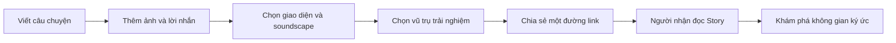

# Lumora

> **Ánh sáng của ký ức** — biến ảnh, lời nhắn và âm thanh không gian thành một trải nghiệm có thể gửi bằng một đường link.

[Website](https://lumora.nguyenvuongw.id.vn/) · [Quy tắc cho AI agent](./AGENTS.md) · [Release checklist](./docs/tmdt-release-checklist.md)

## Sứ mệnh, tầm nhìn và kim chỉ nam

> **Lumora không bán feature. Lumora bán cảm xúc. Feature chỉ tồn tại để tạo ra, truyền tải, dẫn dắt hoặc khuếch đại cảm xúc.**

**Sứ mệnh:** Giúp con người biến những ký ức và điều khó nói thành một trải nghiệm có thể được cảm nhận, không chỉ thành một tập hợp ảnh, chữ hoặc hiệu ứng.

**Tầm nhìn:** Lumora trở thành người đạo diễn trải nghiệm ký ức—phối hợp câu chuyện, cảm xúc, nhịp điệu, soundscape, hình ảnh và không gian để người nhận thực sự đi qua câu chuyện.

User cung cấp ký ức và ý định cảm xúc. Story Engine hiểu câu chuyện nên được kể như thế nào; Story Emotion Engine hiểu câu chuyện nên được cảm nhận như thế nào; Universe quyết định nơi câu chuyện trở nên sống động.

> **North Star: Lumora không render ký ức. Lumora đạo diễn cách ký ức được cảm nhận.**

Mỗi quyết định sản phẩm phải trả lời được: **“Điều này khiến người xem cảm thấy gì?”** Nếu câu trả lời chỉ là “trông đẹp hơn”, điều đó chưa đủ để trở thành một Lumora capability có ý nghĩa.

## Lumora là gì?

Lumora là nền tảng tạo trải nghiệm kỷ niệm tương tác dành cho những điều khó nói thành lời. Người dùng có thể gom ảnh, câu chuyện, caption và soundscape nguyên bản vào một “galaxy” riêng, sau đó gửi cho người nhận bằng một liên kết duy nhất.

Thay vì chỉ mở một album ảnh, người nhận đi qua một hành trình:

1. Đọc **Story Experience** như một cuộc trò chuyện có chủ đích.
2. Bước vào không gian ký ức do người gửi thiết kế.
3. Khám phá ảnh, soundscape và những lời nhắn trong trải nghiệm 3D.

Lumora hướng tới các dịp như sinh nhật, kỷ niệm, lời cảm ơn, lời xin lỗi, tỏ tình hoặc đơn giản là lưu lại câu chuyện của hai người theo một cách đáng nhớ hơn album truyền thống.



## Trải nghiệm chính

### Galaxy cá nhân

Mỗi galaxy là một không gian riêng cho một câu chuyện. Người tạo có thể tải ảnh, đổi tên, sắp xếp nội dung và xem trước trải nghiệm ngay trong màn hình thiết lập.

### Story Experience

Story mở đầu trải nghiệm bằng một mạch kể có cảm xúc trước khi người nhận bước vào galaxy. Nội dung có thể được xây dựng theo dịp, chương và hiệu ứng phù hợp với câu chuyện.

### Hai vũ trụ ký ức

- **Galaxy Classic:** ảnh xuất hiện trong một thiên hà 3D dạng xoắn ốc.
- **Fall Through Memories:** người xem rơi xuyên qua dòng ký ức mang phong cách điện ảnh; đây là tính năng thuộc gói Pro.

Mọi link public đi qua `/view/?galaxyId=...`. Server tự chọn Story, Galaxy Classic hoặc Fall Through Memories dựa trên cấu hình của galaxy.

### Cá nhân hóa

- Themes màu sắc.
- Soundscape nguyên bản được tổng hợp bằng Web Audio trong trình duyệt; từng Galaxy có thể tùy chỉnh nhạc cụ chính, nhịp độ, không gian, biến tấu, cường độ, độ ấm và chuyển động.
- Caption và lời nhắn nổi trong không gian.
- Story theo dịp và nhiều chương.
- Preview trực tiếp trước khi chia sẻ.
- Link public có Open Graph metadata để hiển thị đẹp khi gửi qua mạng xã hội.

### Tài khoản và quản lý phiên

- Đăng ký và xác minh OTP qua email.
- Đăng nhập, quên và đổi mật khẩu.
- Xem các phiên đang hoạt động, thu hồi từng phiên hoặc đăng xuất toàn bộ.
- Xóa tài khoản.

### Subscription và thanh toán

Lumora hỗ trợ các cấp Free, Plus và Pro. Giá, giới hạn và quyền lợi được quản lý tập trung tại [`config/plans.js`](./config/plans.js) và được render động trên Landing, Portal, Admin và trang chính sách thanh toán.

- **Free:** trải nghiệm galaxy cơ bản.
- **Plus:** mở thêm theme và tăng giới hạn galaxy.
- **Pro:** mở toàn bộ theme, caption và Fall Through Memories.
- Catalog nhạc upload/SoundCloud cũ đang bị quarantine để rà soát giấy phép; public viewer không phát các track này.
- Hỗ trợ chu kỳ tháng/năm, rà soát đơn trước khi thanh toán và lịch sử giao dịch có phân trang.
- Luồng PayOS dùng idempotency key và webhook có xác minh chữ ký.
- Admin có thể mở checkout PayOS thật để test end-to-end hoặc dùng luồng mô phỏng riêng không gọi PayOS, không thu tiền thật và không tính vào doanh thu.

> Thanh toán production bị khóa mặc định. Hệ thống chỉ cho phép nhận tiền khi cấu hình chủ sở hữu, nội dung pháp lý, cam kết vận hành và PayOS credentials đã hoàn tất.

## Quyền truy cập

Thứ tự entitlement của hệ thống:

```text
admin > partner (Pro-equivalent) > subscription
```

- Admin được backend cấp toàn bộ quyền và không bị giới hạn số galaxy.
- Admin có quyền mở PayOS thật khi đã cấu hình credentials và chạy payment simulation để kiểm thử luồng giao dịch.
- Partner được dùng các tính năng Galaxy và giới hạn 10 galaxy tương đương Pro, nhưng không có quyền admin hoặc payment simulation.
- User sử dụng quyền từ subscription còn hiệu lực.
- Chạy `npm run dev` không tự mở khóa tính năng sản phẩm.

Role được backend đọc lại từ database khi xác thực JWT. Frontend chỉ sử dụng entitlement do `GET /payment/status` trả về, không tự tin vào role lưu ở client.

## Tracking và vận hành

Lumora có hệ thống activity tracking toàn diện cho bề mặt end-user:

- Page view, tab, CTA và tương tác quan trọng.
- Kết quả mutation ở frontend và backend.
- API failure, lỗi JavaScript, promise rejection và request chậm.
- Payment, subscription, galaxy, Story, upload, account và support flow.
- Session ID và anonymous ID để ghép hành trình người dùng.
- Redaction dữ liệu nhạy cảm, truncation, deduplication và MongoDB TTL retention.
- Opt-out analytics phía người dùng trong khi vẫn giữ security/error log cần thiết.

Admin UI không phải đối tượng tracking; admin dùng dashboard riêng để xem và lọc activity end-user.

## Compliance và hỗ trợ người dùng

Các bề mặt công khai đã được chuẩn bị cho quy trình hoàn thiện website thương mại điện tử:

- Thông tin chủ quản.
- Điều khoản sử dụng và Chính sách bảo mật.
- Chính sách thanh toán.
- Chính sách hủy/hoàn tiền.
- Form hỗ trợ/khiếu nại có mã yêu cầu và rate limit.
- Nội dung Việt/Anh trên các trang công khai mới.
- Payment history và link hỗ trợ gắn mã giao dịch.

Thông tin định danh và cam kết vận hành được lấy từ environment variables, không lưu trực tiếp trong Git. Những quyết định còn chờ PO xác nhận nằm tại [`docs/tmdt-po-decisions.md`](./docs/tmdt-po-decisions.md).

## Công nghệ

| Thành phần | Công nghệ |
|---|---|
| Runtime | Node.js, CommonJS |
| Backend | Express 5 |
| Database | MongoDB, Mongoose |
| Frontend | HTML, CSS, Vanilla JavaScript |
| Trải nghiệm 3D | Three.js và WebGL |
| Authentication | JWT, session ID, bcrypt, email OTP |
| Media | ImageKit, Web Audio soundscape engine |
| Payment | PayOS |
| Email | Nodemailer/Gmail |
| Security | Helmet, CSP, CORS, rate limiting, input validation |
| Testing | Node.js built-in test runner |

## Kiến trúc repository

```text
Lumora/
├── config/          # Plan, compliance, tracking và runtime access mode
├── context/         # Async handler và response chuẩn
├── controllers/     # HTTP orchestration
├── middlewares/     # Auth, entitlement và activity context
├── models/          # Mongoose schemas/indexes
├── routes/          # API routes
├── services/        # Business logic
├── public/          # Website và Portal đang được phục vụ
│   ├── galaxy-moon/ # Galaxy Classic
│   ├── fall/        # Fall Through Memories
│   ├── story/       # Story Experience
│   ├── portal/      # Dashboard và màn hình thiết lập
│   └── shared/      # i18n, tracking và UI dùng chung
├── scripts/         # Audit tooling
├── tests/           # Activity và compliance regression tests
└── docs/            # Product specs, PO decisions và release checklist
```

Backend tuân theo luồng:

```text
route -> auth/middleware -> controller -> service -> model -> response
```

Business rule luôn được thực thi ở server; khóa trên frontend chỉ phục vụ UX.

## Chạy dự án local

### Yêu cầu

- Node.js 20+ được khuyến nghị.
- npm.
- MongoDB database.
- Gmail App Password nếu cần gửi OTP thật.
- ImageKit credentials nếu cần upload ảnh thật.

PayOS không bắt buộc để phát triển các tính năng không liên quan đến thanh toán.

### Cài đặt

```bash
git clone https://github.com/VuongwNguyen/Lumora.git
cd Lumora
npm install
cp .env.example .env
```

Điền ít nhất `DATABASE_URL` và `JWT_SECRET` trong `.env`, sau đó chạy:

```bash
npm run dev
```

Ứng dụng mặc định có tại [http://localhost:3030](http://localhost:3030).

### Environment variables

[`.env.example`](./.env.example) là danh sách chuẩn và được chia theo các nhóm:

- Server/CORS/HTTPS.
- MongoDB và JWT.
- Runtime mode và quyền admin.
- Gmail, ImageKit và cấu hình SoundCloud legacy (không dùng cho public playback khi catalog đang quarantine).
- PayOS.
- Thông tin chủ sở hữu và nội dung compliance.
- Activity tracking và retention.

Không commit file `.env` hoặc credential thật.

Development, test và lệnh chạy không khai báo `NODE_ENV=production` luôn bị
khóa vào database `test`, kể cả khi URI có tên database khác. Trên VPS
production phải đặt `DATABASE_NAME=lumora_prod`; production sẽ từ chối khởi
động nếu thiếu biến này hoặc tên vẫn là `test`/`*_dev`. Việc đổi tên database
không tự di chuyển dữ liệu từ database cũ.

## Scripts

| Lệnh | Mục đích |
|---|---|
| `npm run dev` | Chạy development server với Nodemon |
| `npm start` | Chạy production mode |
| `npm test` | Chạy toàn bộ test activity và compliance |
| `npm run test:activity` | Chạy test tracking |
| `npm run test:tmdt` | Chạy test subscription/payment/compliance |
| `npm run audit:activity` | Audit coverage tracking trên các bề mặt end-user |
| `npm run redeploy` | Kích hoạt GitHub deployment workflow cho `main` |

## Kiểm thử trước khi bàn giao

```bash
npm test
npm run audit:activity
git diff --check
```

Khi sửa file JavaScript độc lập, nên chạy thêm:

```bash
node --check path/to/file.js
```

## Trạng thái sản phẩm

Các nền móng kỹ thuật chính đã có: auth, galaxy/story experience, media, subscription, PayOS infrastructure, payment history, support/compliance pages, admin và end-user tracking.

Trước khi bật thanh toán production vẫn cần:

1. PO xác nhận dữ liệu chủ sở hữu và nội dung pháp lý cuối cùng.
2. Hoàn tất PayOS production credentials.
3. QA luồng thanh toán test, webhook, history và rollback.
4. Chỉ bật `LEGAL_CONTENT_APPROVED=true` và `PAYMENTS_ENABLED=true` sau khi các điều kiện trên đạt.

Xem chi tiết tại:

- [`docs/tmdt-compliance-release-spec.md`](./docs/tmdt-compliance-release-spec.md)
- [`docs/tmdt-po-decisions.md`](./docs/tmdt-po-decisions.md)
- [`docs/tmdt-release-checklist.md`](./docs/tmdt-release-checklist.md)

## Làm việc với AI agent

Mọi AI agent sửa repository này phải đọc [`AGENTS.md`](./AGENTS.md) trước. Tài liệu đó quy định nguồn dữ liệu dùng chung, entitlement, payment safety, tracking, test, bảo mật và quy trình Git.

Nếu thêm tính năng end-user mới, phải đồng thời xem xét:

- Backend authorization và ownership.
- Plan/feature entitlement.
- Activity tracking.
- Empty/loading/error states.
- Responsive và accessibility.
- Regression test.
